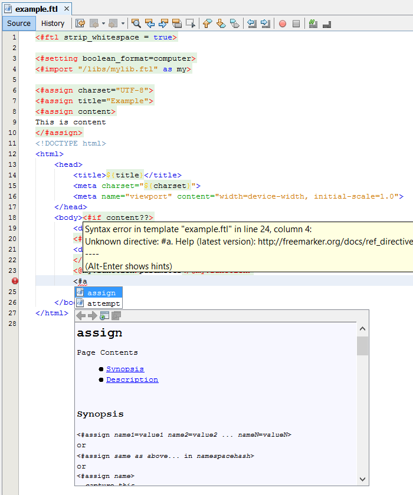

# Lutece plugin for Netbeans

This plugin uses code from rostanek/freemarker-support-for-netbeans for 
Lutece templates using Freemarker :
- syntax coloring
- parsing with error highlighting
- tags matching
- occurences marking
- configuration of embedded language (default is HTML)
- code completion of: directives, built-ins, variables, ftl-tag parameters, setting-tag names
- documentation of directives and built-ins above code completion

